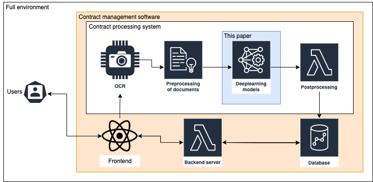

# Legal contract elements

==============================


_This project is part of a 10 ects advanced project course at the Technical University of Denmark_

The objective of this paper is to present deep learning
models for extracting context meta-features from legal doc-
uments, with the perspective of investigating the feasibility
of implementing the aforementioned intelligent contract man-
agement/searching systems based on the presented models. An outline of the full system can be seen in the figure above. What this
paper asses is the blue square - the deep learning models that
powers it. The context meta-features investigated are a subset
of the contract elements that occurs most frequent in the used
dataset. This is Document Title, Document Type, Agreement-
, Renewal-, Expiration-, and Effective Dates. This project is
limited to these parts to reduce the scope. Furthermore, these
elements can in most cases be found on first page of the doc-
ument or narrowed down to being on a specific page using
regex. This drastically reduces the text spans to investi-
gate from full contracts to smaller text sections, which is an
assumption used in section

The project will test a vareity of of models such as

- BiDAF
- DrQA / Stanford Attentive Reader
- GPT-3
- RoBERTa from the original authors of the CUAD project

## [Link to paper](./reports/Advanced_Project__Document_Parsing_final.pdf)

### Data

The data source for the main task of contract element prediction is the [CUAD](https://www.atticusprojectai.org/cuad) Commercial Contracts dataset - A corpus of 13,000+ labels in 510 commercial legal contracts with rich expert annotations, by [The Atticus Project](https://www.atticusprojectai.org/). Furthermore, the [SQuAD](https://arxiv.org/abs/1606.05250) dataset will also play a large role in training the models.

## Project Organization

    ├── LICENSE
    ├── Makefile           <- Makefile with commands like `make data` or `make train`
    ├── README.md          <- The top-level README for developers using this project.
    ├── data
    │   ├── external       <- Data from third party sources.
    │   ├── interim        <- Intermediate data that has been transformed.
    │   ├── processed      <- The final, canonical data sets for modeling.
    │   └── raw            <- The original, immutable data dump.
    │
    ├── docs               <- A default Sphinx project; see sphinx-doc.org for details
    │
    ├── models             <- Trained and serialized models, model predictions, or model summaries
    │
    ├── notebooks          <- Jupyter notebooks. Naming convention is a number (for ordering),
    │                         the creator's initials, and a short `-` delimited description, e.g.
    │                         `1.0-jqp-initial-data-exploration`.
    │
    ├── references         <- Data dictionaries, manuals, and all other explanatory materials.
    │
    ├── reports            <- Generated analysis as HTML, PDF, LaTeX, etc.
    │   └── figures        <- Generated graphics and figures to be used in reporting
    │
    ├── requirements.txt   <- The requirements file for reproducing the analysis environment, e.g.
    │                         generated with `pip freeze > requirements.txt`
    │
    ├── setup.py           <- makes project pip installable (pip install -e .) so src can be imported
    ├── src                <- Source code for use in this project.
    │   ├── __init__.py    <- Makes src a Python module
    │   │
    │   ├── data           <- Scripts to download or generate data
    │   │   └── make_dataset.py
    │   │
    │   │
    │   └── models         <- Scripts to train models and then use trained models to make
    │                         predictions
    │
    └── tox.ini            <- tox file with settings for running tox; see tox.readthedocs.io

---

## How to run it

The core models **DrQA** and **BiDAF** can be found in the src/models. The **DrQA** requires the repo to be installed, but the **BiDAF** can be run as is.

```
# Create and activate a conda enviroment. Tested with Python 3.9.7
pip install -r requirements.txt

# Setup Weights and Biases
wandb login

# Install repo
pip install .

# Create the datasets
python3 src/data/make_dataset_cuad.py
python3 src/data/make_dataset_squad.py

# Run training
python3 src/models/bidaf/bidaf_train.py
```

### Online interaction with the models

---

Coming soon :)

### References from the project

---

Please see references/refs.bib

### Model checkpoints

---

The models have fairly little training (15 epoch) which can be obtained in 4-5 hours of training using a Nvidia Tesla K80 thus the state checkpoints have been ommitted from the repo. The DrQA checkpoint for SQuAD and BiDAF for CUAD can be found [here](https://dtudk-my.sharepoint.com/:u:/r/personal/s174315_dtu_dk/Documents/Models.zip?csf=1&web=1&e=FPiNHa) (you might need to request access due to DTU it policy)

### TODO:

- [ ] Fix redundancy between modules in BiDAF
- [ ] Remove need for pip installing package to use DrQA
- [ ] Setup streamlit app like [this one](https://github.com/marshmellow77/cuad-demo/blob/main/scripts/streamlit_app.py) for inference
